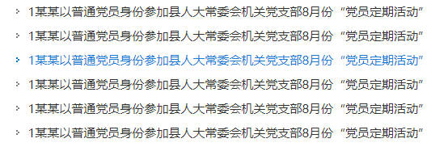

# 02. NewsList （新闻列表）
## 示例
 

## 应用
```javascript
// xxx.pug部分
include ../../../components/NewsList.pug

.yydh-div
    +NewsList(6)
```

## 参数
| 参数 | 类型 | 例子 |备注 |
|-----|-----|------|------|
| length | number   | 5 | 指的是新闻的数量 |