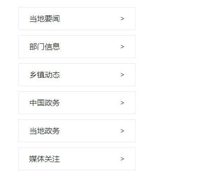

# 03. SlideNav （侧边导航）
## 示例
 

## 应用
```javascript
// xxx.pug部分
include ../../../components/SlideNav.pug

.yydh-div
    +SlideNav(['当地要闻', '部门信息', '乡镇动态', '中国政务', '当地政务', '媒体关注'])
```

## 参数
| 参数 | 类型 | 例子 |备注 |
|-----|-----|------|------|
| arr | array   | ['当地要闻', '部门信息', '...'] | 需要展示的导航名字 |