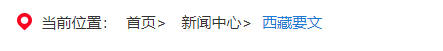

# 06. Location （当前位置）
## 示例
 

## 应用
```javascript
// xxx.pug部分
include ../../../components/Location.pug

.yydh-div
    +Location({name: '您当前所在位置',arr: ['首页','细览']})
```

## 参数
| 参数 | 类型 | 例子 |备注 |
|-----|-----|------|------|
| obj | object   | {name: '您当前所在位置',arr: ['首页','细览']} | 见下一个表格 |


| key | 类型 | 例子 |备注 |
|-----|-----|------|------|
| arr | array   | ['首页','细览'] | 路径 从头到尾的数组 |
| name | string   | '您当前所在位置' | 指的是当前所在位置的描述 |