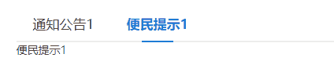

# 07. CmTab （切换）
## 示例
 

## 应用
```javascript
// xxx.pug部分
include ../../../components/CmTab.pug

.yydh-div
    +CmTab({arr:['通知公告1', '便民提示1'], topClass:'top1',  contClass: 'cont1'})

//- 支持自定义item
 +CmTab({arr:['通知公告1','便民提示1'], topClass:'top1', contClass: 'cont1'})
    .tabItem(style="font-size: 16px")
        |  111
    .tabItem(style="font-size: 16px")
        |  222

// xxx.js部分
// 自己在pug添加所需js
$('.tab .cm-tab').tabSwitch({
    tabHead: '.top1 .panel',
    tabCont: '.cont1 .tabItem',
    cur: 'cur'
});
```

## 参数
| 参数 | 类型 | 例子 |备注 |
|-----|-----|------|------|
| obj | object   | { arr: ['通知公告1', '便民提示1'],  topClass: 'top1',  contClass: 'cont1'} | 见下一个表格 |


| key | 类型 | 例子 |备注 |
|-----|-----|------|------|
| arr | array   | ['中央部省网站1', '中央部省网站2',...] | 指的是友情链接初始的名字 |
| topClass | string   | 'top1' | 指的是tab头部的class 用于js |
| contClass | string   | 'cont1' | 指的是tab内容部的class 用于js |