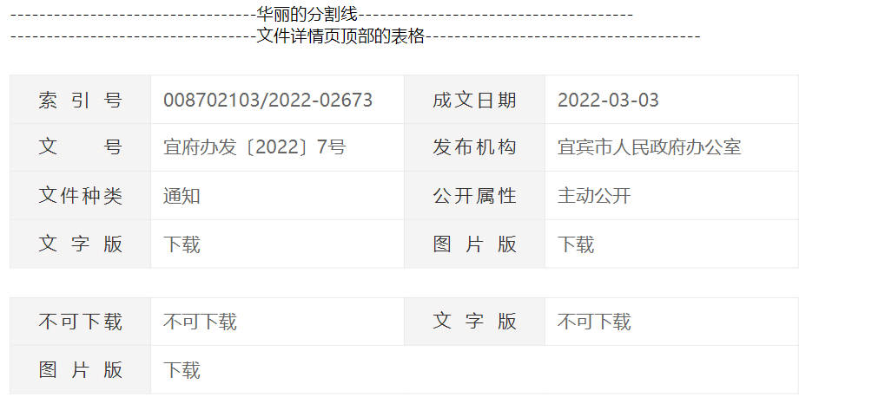

# 10. DetailsTable （详情顶部的表格）
## 示例
 

## 应用
```javascript
// xxx.pug部分
include ../../../components/DetailsTable.pug

.yydh-div.toutiao
    +DetailsTable()
.yydh-div.toutiao
    +DetailsTable([{ key: '不可下载', value: '不可下载'}, { key: '文字版', value: '下载', link: true }, { key: '图片版', value: '下载', link: true }])

```

## 参数
| 参数 | 类型 | 例子 |备注 |
|-----|-----|------|------|
| obj | array   | [{ key: '不可下载', value: '不可下载'}, { key: '文字版', value: '下载', link: true }, { key: '图片版', value: '下载', link: true }] | 见下一个表格 |

| key | 类型 | 例子 |备注 |
|-----|-----|------|------|
| key | string   | '索引号' | 表格左边的key |
| value | string   | '00000001111111' | 表格左边key的value |
| link | boolean or undefined   | true or false or undefined  | 传布尔值或者不传 |