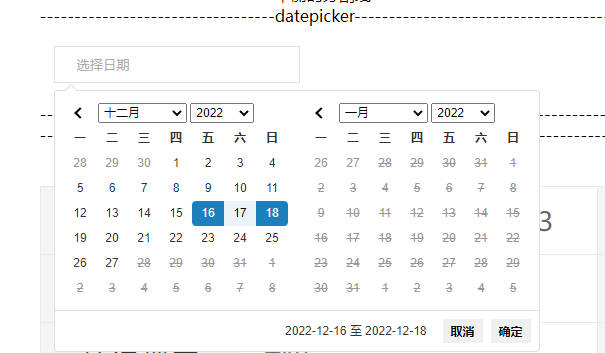

# 11. DatePicker （日期选择器）
## 示例
 

## 应用
```javascript
// xxx.pug部分
include ../../../components/DatePicker.pug

.yydh-div.datepicker(style="width: 2rem")
    +DatePicker({inputClass: 'datepickers'})

.yydh-div.datepicker(style="width: 3rem")
    +DatePicker({datePickerClass: 'datepickers2', type: '2', inputStartClass: 'start', inputStartPlaceholder: '年-月-日',inputEndPlaceholder: '结束时间', inputEndClass: 'end', separate: '至'})

// xxx.js部分
// 自己在pug添加所需js
// 引入插件的js和css
link(rel="stylesheet" type="text/css" href="./lib/css/daterangepicker3.14.1.css")
script(type="text/javascript" src="./lib/js/moment2.18.1.min.js")
script(type="text/javascript" src="./lib/js/daterangepicker3.1.min.js")
$('.datepickers').daterangepicker({
    locale: {
        "format": 'YYYY-MM-DD',
        "separator": " 至 ",
        "applyLabel": "确定",
        "cancelLabel": "取消",
        "resetLabel": "重置",
        "fromLabel": "起始时间",
        "toLabel": "结束时间'",
        "customRangeLabel": "自定义",
        "weekLabel": "W",
        "daysOfWeek": ["日", "一", "二", "三", "四", "五", "六"],
        "monthNames": ["一月", "二月", "三月", "四月", "五月", "六月", "七月", "八月", "九月", "十月", "十一月", "十二月"],
        "firstDay": 1,
    },
    "autoUpdateInput": false,
    "showDropdowns": true,
    "singleDatePicker":false,
    "alwaysShowCalendars": true,
    "startDate": moment().subtract(6, 'days'),  //7天前
    "endDate": new Date(),                      //现在
    "opens": "right",
    "linkedCalendars": false,
    "maxDate": new Date(),
})
// 点击取消
$('.datepickers').on('cancel.daterangepicker', function(ev, picker) {
    $('.datepickers').val('');
});
// 点击确定
$('.datepickers').on('apply.daterangepicker', function(ev, picker) {
    $('.datepickers').data('daterangepicker').autoUpdateInput=true;
    console.log(picker.startDate.format('YYYY-MM-DD'));
    console.log(picker.endDate.format('YYYY-MM-DD'));
});

$('.datepickers2').daterangepicker({
    locale: {
        "format": 'YYYY-MM-DD',
        "separator": " 至 ",
        "applyLabel": "确定",
        "cancelLabel": "取消",
        "resetLabel": "重置",
        "fromLabel": "起始时间",
        "toLabel": "结束时间'",
        "customRangeLabel": "自定义",
        "weekLabel": "W",
        "daysOfWeek": ["日", "一", "二", "三", "四", "五", "六"],
        "monthNames": ["一月", "二月", "三月", "四月", "五月", "六月", "七月", "八月", "九月", "十月", "十一月", "十二月"],
        "firstDay": 1,
    },
    "autoUpdateInput": false,
    "showDropdowns": true,
    "singleDatePicker":false,
    "alwaysShowCalendars": true,
    "startDate": moment().subtract(6, 'days'),  //7天前
    "endDate": new Date(),                      //现在
    "opens": "right",
    "linkedCalendars": false,
    "maxDate": new Date(),
})
// 点击取消
$('.datepickers2').on('cancel.daterangepicker', function(ev, picker) {
    $('.start').val('');
    $('.end').val('');
});
// 点击确定
$('.datepickers2').on('apply.daterangepicker', function(ev, picker) {
    console.log(picker.startDate.format('YYYY-MM-DD'));
    console.log(picker.endDate.format('YYYY-MM-DD'));
    $('.start').val(picker.startDate.format('YYYY-MM-DD'));
    $('.end').val(picker.endDate.format('YYYY-MM-DD'));
});
```

## 参数
| 参数 | 类型 | 例子 |备注 |
|-----|-----|------|------|
| obj | object   | {datePickerClass: 'datepickers2', type: '2',placeholder: '11111', inputStartClass: 'start', inputStartPlaceholder: '年-月-日',inputEndPlaceholder: '结束时间', inputEndClass: 'end', separate: '-'} | 见下一个表格 |

| key | 类型 | 例子 |备注 |
|-----|-----|------|------|
| datePickerClass | string   | 'datePickerClass' | 用于初始化的class |
| type | string   | '1' or '2' | 1：单输入框类型 2：双输入框类型 |
| placeholder |  string  |  '选择日期' | 单input框input无值的时候显示的内容 |
| inputStartClass |  string  |  'start' | 用于多input框input 左侧开始时间赋值的类名 |
| inputStartPlaceholder |  string  |  '选择日期' | 多input框input 左侧开始时间无值的时候显示的内容 |
| inputEndClass |  string  |  'end' | 用于多input框input 右侧结束时间赋值的类名 |
| inputEndPlaceholder |  string  |  '选择日期' | 多input框input 右侧结束时间无值的时候显示的内容 |
| separate |  string  |  '至' | 多input框 左右两侧时间中间的间隔符 |