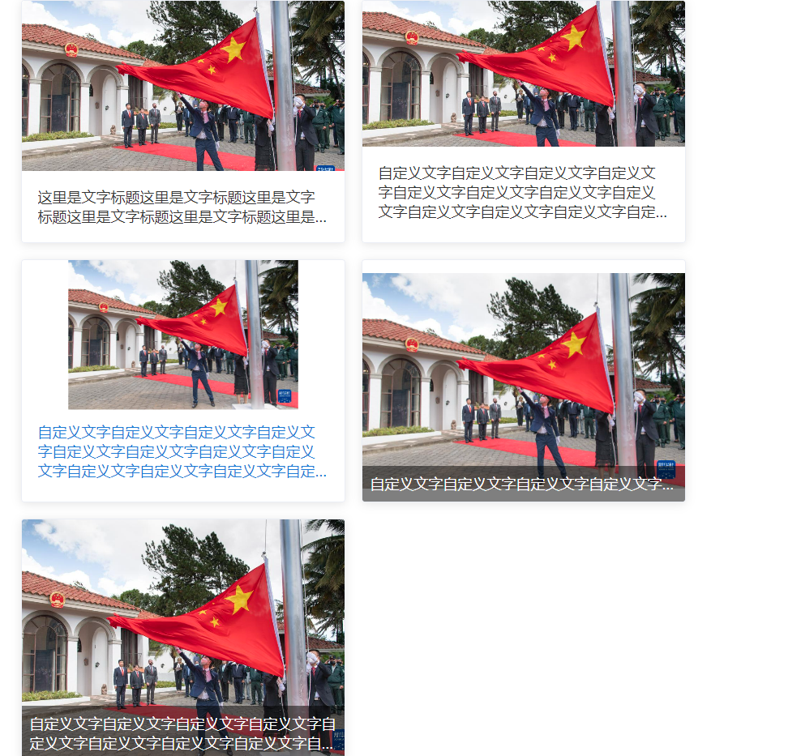

# 12. CmCard （卡片）
## 示例
 

## 应用
```javascript
// xxx.pug部分
include ../../../components/CmCard.pug

// 说明
// 1. card的大小取决于card外层的盒子大小
// 2. 鼠标移入样式，取决于自己自定义的css（组件内部会有个默认的）
// 3. 特殊样式需要自己加css解决
.yydh-div(style="width: 4rem;height: 3rem;display: inline-block;margin-top: 0.2rem;").act-big.yydh-cm-card6
    +CmCard({imgName:"lunbo-big.png", lineClamp: '2',textPosition: 'in' , text: '自定义文字自定义文字自定义文字自定义文字自定义文字自定义文字自定义文字自定义文字自定义文字自定义文字自定义文字自定义文字自定义文字自定义文字自定义文字'})
    // 自定义需要得css
    style. 
        .yydh-cm-card6 img {height: 100%; object-fit: cover;}
```

## 参数
| 参数 | 类型 | 例子 |备注 |
|-----|-----|------|------|
| obj | object   | {imgName:"lunbo-big.png", lineClamp: '2',textPosition: 'in' , text: '自定义文字自定义文字自定义文字自定义文字自定义文字自定义文字自定义文字自定义文字自定义文字自定义文字自定义文字自定义文字自定义文字自定义文字自定义文字'} | 见下一个表格 |

| key | 类型 | 例子 |备注 |
|-----|-----|------|------|
| imgName | string   | 'lunbo-big.png' |需要展示的图片名称，在自己项目内部 |
| text | string   | '自定义标题' | 标题 |
| textPosition | string   | 'bottom' or 'in' | bottom或者不传为默认上图下文模式，in: 文字在图片里面|
| lineClamp | string   | '1' or '2' or '3'| 默认一行移除隐藏 |