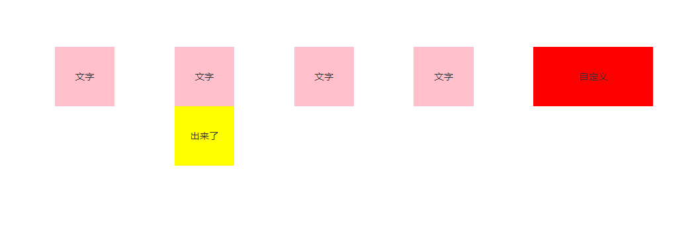

# 13. HoverShow （移入显示）
## 场景
### 一、弹出微信二维码
 
### 二、弹出客户端下载二维码
 
## 示例
 
在需要应用的地方

```javascript
// xxx.pug部分
// 引入
include ../../../components/HoverShow.pug

// 说明
// 1. 外层必须类名cm-hoverShowOut
// 2. 内层必须类名cm-hoverShowIn, 方向也直接定义在此类上（top/bottom/left/right）
// 3. 特殊样式需要自己加css解决
// 4. 前四个例子是demo，应用实际场景请参照第五个例子，都需要自己定义
.yydh-div(style="padding:1.5rem;")
    .hovershow(style="display:inline-block;width:2rem;margin-bottom:1.5rem;")
        +HoverShow({placement:'top'})
    .hovershow(style="display:inline-block;width:2rem;margin-bottom:1.5rem;")
        +HoverShow({placement:'bottom'})
    .hovershow(style="display:inline-block;width:2rem;margin-bottom:1.5rem;")
        +HoverShow({placement:'left'})
    .hovershow(style="display:inline-block;width:2rem;margin-bottom:1.5rem;")
        +HoverShow({placement:'right'})
    .hovershow(style="display:inline-block;width:2rem;margin-bottom:1.5rem;")
    +HoverShow()
        .cm-hoverShowOut(style="width: 2rem;background: red;")
            p(style="font-size:0.16rem;color: #333;line-height: 1rem; text-align: center;") 自定义
            .cm-hoverShowIn.bottom
                p(style="font-size:0.16rem;color: #333;line-height: 1rem; text-align: center;") 自定义chulai 
```
| 参数 | 类型 | 例子 |备注 |
|-----|-----|------|------|
| obj | object   | {placement:"bottom"} | 见下一个表格 |

| key | 类型 | 例子 |备注 |
|-----|-----|------|------|
| placement | string   | 'bottom' |方向 |